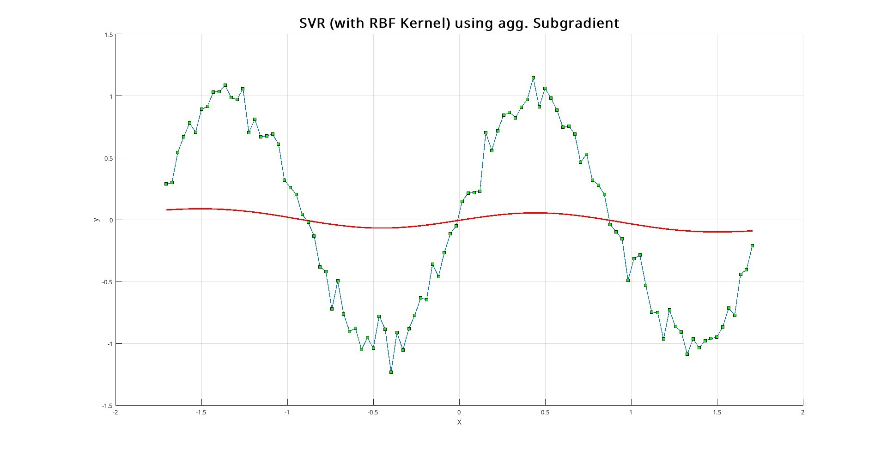

\newpage
# Conclusions

## Hyperparameters Used

During the hyperparameter selection phase for the various SVR models, we maintained the same values as much as possible to ensure a fair and consistent comparison among the different approaches. However, for the oracle implementation, it was not feasible to use the `quadprog` method due to the high number of constraints present in the problem. Consequently, we opted for an alternative algorithm, Sequential Minimal Optimization (SMO), which is capable of efficiently handling large datasets. All other parameters were kept at their default values.

### SVR Parameters:
- **`kernel_function`**: `RBFKernel()` 
  *Kernel function used in the Support Vector Regression (SVR) model (Radial Basis Function Kernel in this case).*
- **`C`**: 1 
  *Regularization parameter for the SVR model, controlling the trade-off between model complexity and training error.*
- **`epsilon`**: 0.1 
  *Epsilon margin for the SVR model, defining the tolerance for prediction errors.*
- **`opt`**: `lbm` 
  *Optimizer used for the SVR model (Level Bundle Method in this case).*

### LBM Parameters:
- **`max_iter`**: 500 
  *Maximum number of iterations for the Level Bundle Method (LBM).*
- **`epsilon`**: 1e-6 
  *Convergence tolerance for the LBM algorithm.*
- **`tol`**: 0.1 
  *Tolerance for the subgradient step in the LBM.*
- **`theta`**: 0.5 
  *Convex combination parameter used in the LBM.*
- **`max_constraints`**: 20 
  *Maximum number of constraints allowed in the bundle.*

## Results

\begin{table}[h]
\centering
\renewcommand{\arraystretch}{0.9} % Riduce l'altezza delle righe
\setlength{\tabcolsep}{2pt} % Riduce lo spazio tra le colonne

\resizebox{1.0\textwidth}{!}{%
\begin{tabular}{|p{2.5cm}|p{1.5cm}|p{2cm}|p{1.5cm}|p{2cm}|p{1.5cm}|p{2cm}|p{1.5cm}|p{2cm}|}
\hline
Funzione & \multicolumn{2}{c|}{SVR} & \multicolumn{2}{c|}{SVR with LBM} & \multicolumn{2}{c|}{SVR with aggr. subgr.} & \multicolumn{2}{c|}{Oracle} \\
\hline
 & MSE & Training time & MSE & Training time & MSE & Training time & MSE & Training time \\
\hline
Sine & 0.0114 & 0.025016 & 0.012 & 0.386 & 0.0249 & 0.002934 & 0.0104 & 0.047736 \\
Exp & 0.0854 & 0.012039 & 0.0558 & 0.252 & 0.1040 & 0.003823 & 0.0356 & 0.036522 \\
Step & 0.0342 & 0.007809 & 0.0307 & 0.287 & 0.0527 & 0.003804 & 0.0328 & 0.132662 \\
Outlier & 0.2091 & 0.007259 & 0.2294 & 0.220 & 0.2249 & 0.003535 & 0.2205 & 0.010427 \\
Abalone & / & $\infty$ & 4.23 & 17.61 & 4.26 & 4.103455 & 4.10 & 0.464732 \\
\hline
\end{tabular}%
}
\end{table}

## Final Remarks

The results clearly indicate that solving a quadratic programming problem at every iteration considerably increases the training time. In contrast, the aggregated subgradient method, which involves simpler operations, converges more quickly. However, unlike the Level Bundle Method, the aggregated subgradient approach is highly sensitive to the choice of hyperparameters such as the aggregation strategy and step size. Incorrect parameter choices can lead to model instability.

*Example of an SVR using aggregated subgradient with an excessively low tolerance*

Furthermore, the oracle—implemented using SMO—demonstrates significantly superior training times compared to our models. This is primarily due to the fact that SMO employs a more efficient solver by leveraging the Karush-Kuhn-Tucker (KKT) conditions for faster convergence.

Nevertheless, it is important to note that the mean error (MSE) achieved by our model does not deviate significantly from that of the oracle, despite the longer training times. This indicates that while our approach is computationally more intensive, it still yields competitive prediction accuracy.