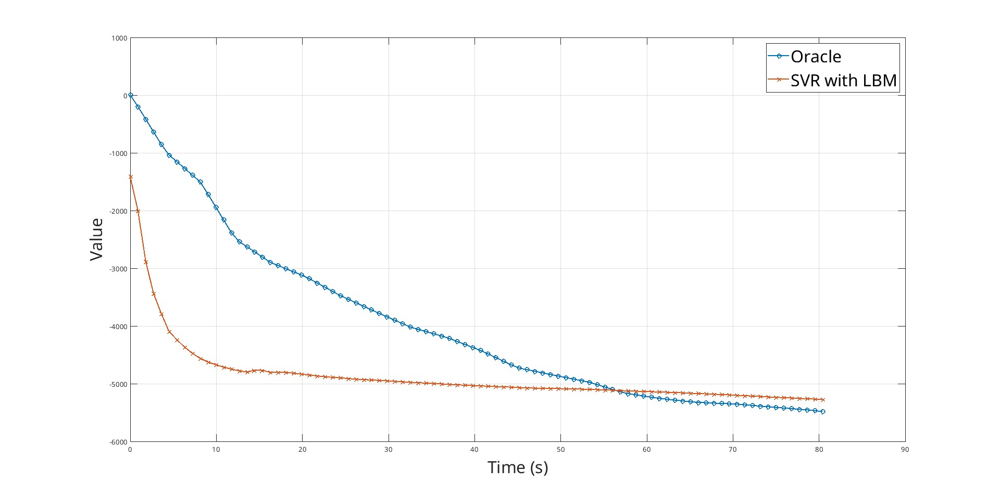

\newpage
# Achieved Results

In this chapter, we present the results obtained on various datasets, comparing the SVR with Level Bundle Method (LBM) against a classical SVR implementation, referred to as the *Oracle*. The hyperparameters used in each experiment are reported, and efforts were made to keep them as similar as possible to ensure a fair comparison.

As stated in the introductory chapter, the goal of this project is **not** to achieve the best possible MSE through extensive hyperparameter tuning. Instead, the objective is to demonstrate that the Level Bundle Method can deliver **comparable—if not superior—performance** to that of a classical SVR.

The dataset used are: Abalone, ...

## Abalone

### Common Parameters
| Parameter | Value |
| :-------- | ----- |
| Kernel    | RBF   |
| C         | 1     |
| Epsilon   | 0.05  |

### Oracle
| Iterations | MSE    | Time (s) |
| ---------- | ------ | -------- |
| 60         | 4.2186 | 292.2166 |

### SVR with Level Bundle Method (LBM)

- **tol**: `1e-2`  
  Tolerance for stopping criterion.
- **theta**: `0.5`  
  Controls the trade-off between cutting plane approximation and descent direction.
- **lr** (learning rate): `1e-07`  
  Step size for the gradient-based update.
- **momentum**: `0.3`  
  Momentum term to accelerate convergence and avoid local minima.
- **scale_factor**: `1e-05`  
  Scaling coefficient applied to linear and quadratic terms.
- **max_constraints**: `60`  
  Maximum number of cutting planes (constraints) maintained in the bundle.

| Iterations | MSE    | Time (s) |
| ---------- | ------ | -------- |
| 60         | 4.2819 | 28.2933  |
| 90         | 4.1963 | 88.0550  |

As observed, the *Oracle* achieves excellent results in just a few iterations, which suggests that `fmincon` is a highly effective solver for this specific type of problem. We also experimented with other alternatives, such as `quadprog`, but the resulting Hessian matrix proved to be unmanageable for large-scale problems like this one, making its use impractical.

An interesting observation is that once the minimum is reached, `fmincon` tends to plateau without further improvements. However, the major drawback is the training time: the average time between iterations is around **6 seconds**, resulting in very high total runtimes.

Our SVR implementation with LBM, on the other hand, performs slightly worse with the same number of iterations, but when increasing the iteration count moderately, it achieves an **even lower MSE** than the Oracle.

This graph shows the behavior of the function at the same time t, using the best parameters for both SVRs. Since the times for the 2 SVRs are markedly different, the values have been interpolated to the values at the common time, so it is easier to understand what happens at time t.

One particularly interesting aspect, evident from this time-based plot, is that up to around **60 seconds**, our LBM-SVR approaches the function minimum much faster, while the Oracle lags significantly behind. Notably, there exists a time `t` at which both models reach **similar performance levels**.

Another key observation comes from the **relative gap** plot: despite the differences in runtime, the learning behavior is remarkably comparable. This indicates that the introduction of regularization had a **stabilizing effect** on the optimization dynamics.
