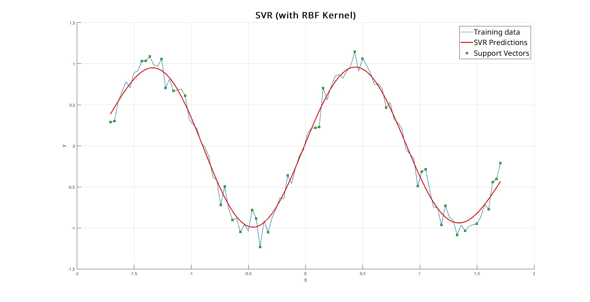
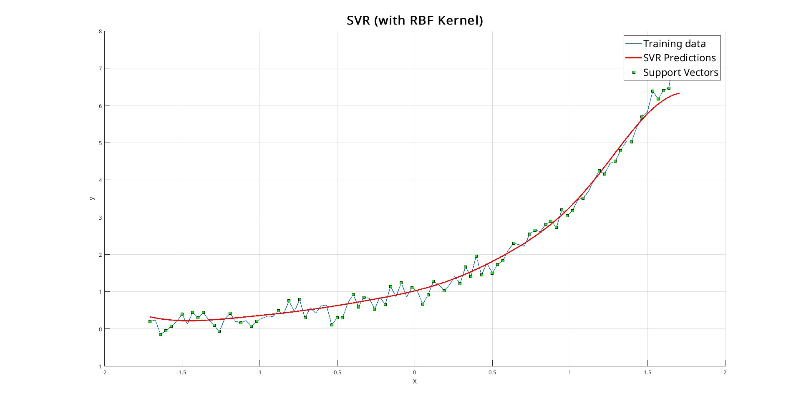
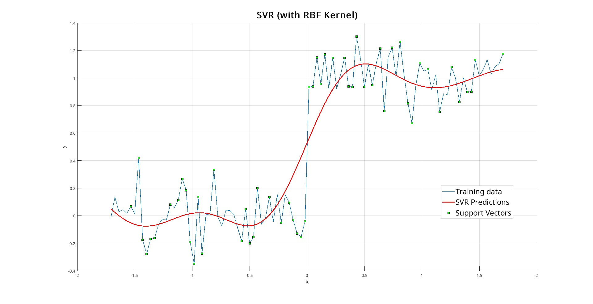
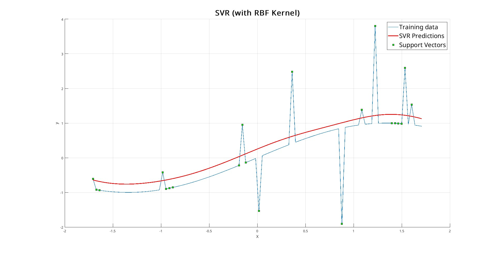
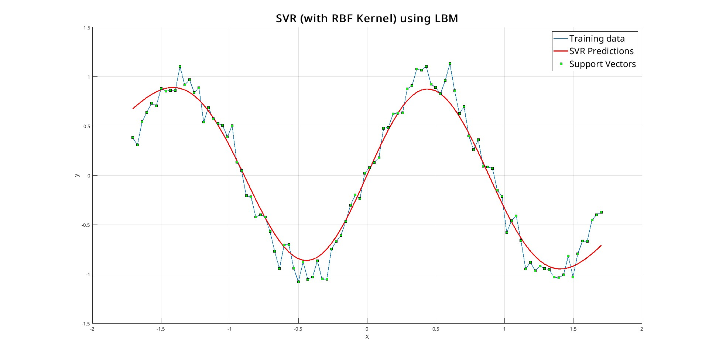
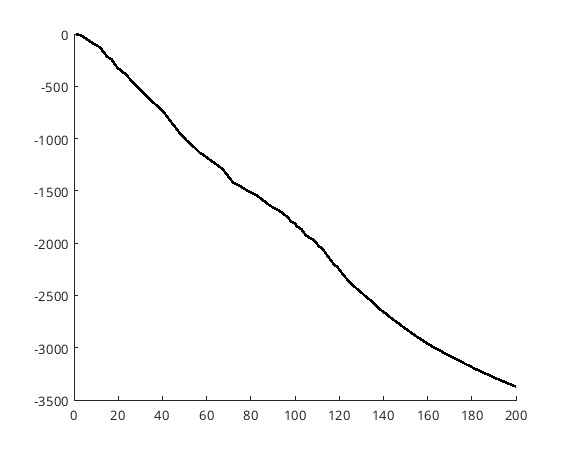
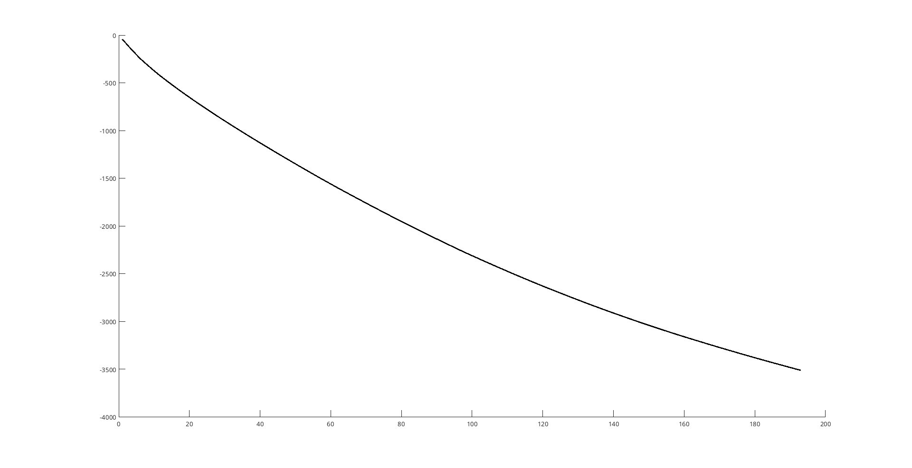

\newpage

# Implementation

## Dataset

Initially, we used simple functions such as sine, exponential, and step functions with added noise. These synthetic datasets allowed us to test and verify the correctness of our SVR implementation in terms of predictions and performance. <br/>
Subsequently, we moved to a larger and more complex dataset: the **Abalone dataset**. This is a regression dataset where the goal is to predict the age of abalones based on various features.

The dataset is structured as follows:

- The first 8 columns correspond to the input features.
- The last column represents the target value (age of the abalone).

Before training, the features are normalized using `zscore`:

```matlab
[X, y] = training_data("abalone"); % Alternatively: sin, exp ..
X = zscore(X);
```

## (A1) SVR general-purpose solver 

For the implementation of a general-purpose Support Vector Regression (SVR), we formulated the problem in its **dual form**. The Hessian matrix was constructed using the kernel function, while the linear terms and the equality/bound constraints were transformed into vectors compatible with MATLAB’s `quadprog` solver.

```matlab
% Construct the Hessian matrix using the kernel function
H = [K, -K; -K, K];

% Linear terms of the objective function
f = [epsilon + Y; epsilon - Y]';

% Equality constraint: sum(alpha - alpha_star) = 0
Aeq = [ones(1, length(Y)), -ones(1, length(Y))];
beq = 0;

% Lower and upper bounds: 0 <= alpha, alpha_star <= C
lb = zeros(2 * length(Y), 1);
ub = obj.C * ones(2 * length(Y), 1);

% Solve the quadratic programming problem using quadprog
options = optimoptions('quadprog', 'Display', 'off');
z = quadprog(H, -f, [], [], Aeq, beq, lb, ub, [], options);
```

 Once `quadprog` has completed execution, we extract the **support vectors** from the solution by analyzing the coefficients $\alpha_i, \alpha_i^*$.

```matlab
% Retrieve alpha coefficients
alpha_pos = z(1:length(Y));
alpha_neg = z(length(Y)+1:end);
alpha_svr = alpha_pos - alpha_neg;

% Identify support vectors based on tolerance threshold
sv_indices = find(abs(obj.alpha_svr) > obj.tol);

% Compute bias for the prediction phase
bias = mean(Y(sv_indices) - K(sv_indices, :) * alpha_svr);
```

### Performance Evaluation

We evaluated this SVR implementation on both synthetic datasets and the **Abalone dataset**. While the model generalizes well on synthetic data, its performance deteriorates significantly on the Abalone dataset due to the **high number of constraints**. This leads to an exponential increase in computational complexity, making `quadprog` unable to terminate in reasonable time for large-scale problems.

Below are the used functions along with their corresponding output graphs:

- **Sine function**
  $$ Y = \sin(3X) + 0.1 \cdot \mathcal{N}(0, 1). $$
  

- **Exponential function**
  $$ Y = e^{X} + 0.2 \cdot \mathcal{N}(0, 1). $$
  

- **Step function**
  $$ Y = \mathbb{1}_{\{X > 0\}} + 0.15 \cdot \mathcal{N}(0, 1). $$
  
  \newpage
- **Outliers test**
  $$ Y = \sin(X) + \underbrace{2 \cdot \mathcal{N}(0, 1)}_{\text{10 random points}}. $$
  

### Results

As expected, the SVR produced accurate predictions, achieving low MSE values (about 0.0106) despite the added Gaussian noise. These synthetic datasets were crucial in validating the correct behavior of our model.

\newpage

## (A2) Level Bundle Method Implementation

Previously, we mathematically formulated the objective function and constraints of the **Level Bundle Method (LBM)** in a format compatible with `quadprog`. We now translate these formulations into MATLAB code, ensuring a direct correspondence between the mathematical expressions and their implementation.

### Hessian Matrix and Linear Coefficients

The objective function of the optimization problem is defined as:
$$
H = I, \quad f = -\hat{x}_k.
$$

In MATLAB, this is implemented as:

```matlab
H = eye(n);
f = [-x_k; 1];
```

### Inequality Constraints

The linear constraints are represented in matrix form as:
$$
A = \begin{bmatrix} \xi_j^\top & -1 \end{bmatrix}, \quad b = \langle \xi_j, y_j \rangle - f(y_j).
$$

Translated into MATLAB:

```matlab
A = [bundle.g' -ones(m,1)]; % Constraint matrix A
b = sum(bundle.g .* bundle.z, 1)' - bundle.f'; % Right-hand side vector
```

where `bundle.g` stores the gradients of the constraints, and `bundle.z` contains the support points. The dot product provides the values of **b**.

### Equality Constraints

The equality constraints are given by:
$$
A_{eq} = \begin{bmatrix} \mathbf{1}^\top & -\mathbf{1}^\top \end{bmatrix}, \quad b_{eq} = 0.
$$

MATLAB implementation:

```matlab
Aeq = [ones(1,n) -ones(1,n) 0]; % Equality constraint matrix
beq = 0; % Right-hand side value
```

### Variable Bounds

The variables are subject to the following bounds:
$$
\begin{aligned}
lb &= [0,\, -\infty], \\
ub &= [C,\, t_{\text{level}}].
\end{aligned}
$$

Implemented as:

```matlab
lb = [zeros(n2,1); -inf]; % Lower bounds
ub = [C * ones(n2,1); t_level]; % Upper bounds
```

Here, `C` controls the penalty for errors, while `t_level` influences the step size.

### Solving the Optimization Problem

Finally, we use `quadprog` to find the optimal solution:

```matlab
x = quadprog(H, f, A, b, Aeq, beq, lb, ub, [], options);
```
\newpage
## LBM Algorithm Implementation

```matlab
Input:
    z          % Current solution (dual vector)
    bundle     % Structure containing constraints (values, subgradients, support points)
    t          % Proximity parameter
    C          % Upper bound on dual variables
    theta      % Level parameter
    tol        % Convergence tolerance
    max_iter   % Maximum number of iterations

% Initialization
f = obj_function(z)
f_best = f

for iter = 1 to max_iter:
    % Compute the acceptance level
    level = theta * f + (1 - theta) * f_best

    % Solve the master problem to get the new point
    z_new = mp_solve(z, bundle, t, C)

    % Evaluate the function and subgradient at z_new
    (f_new, g_new) = svr_dual_function(z_new)

    % Check if the new point is acceptable
    if f_new <= level:
        z = z_new
        f = f_new
        if f_new < f_best:
            f_best = f_new
    else:
        % If not accepted, reduce t
        t = t * 0.5

    % Check for convergence
    if ||z_new - z|| < tol:
        break

return z  % Return the optimal solution
```

---

# Performance Evaluation

## SVR Training with LBM on Synthetic Data

To evaluate the performance of our SVR (Support Vector Regression) model implemented with the Level Bundle Method (LBM), we conducted preliminary testing on predefined synthetic datasets. The results demonstrate that the model retains the generalization capability characteristic of classical SVR while maintaining comparable computational efficiency in terms of execution time.

Below, we present the predictive performance on the sine function as a representative example of the model’s generalization capabilities. The remaining functions (omitted for brevity) demonstrate behaviors fully aligned with the standard SVR implementation.

- **Sine function**
  $$Y = \sin(3X) + 0.1 \cdot \mathcal{N}(0, 1). $$
  

### Training SVR with LBM on the Abalone Dataset

As mentioned earlier, we used the Abalone dataset to evaluate the actual performance of our SVR implementation. This dataset contains 4177 samples with 8 features each, making it a perfect candidate as it introduces challenges such as:

- A high number of constraints
- Increased memory consumption
- Prolonged training time due to repeated calls to the solver

#### High Number of Constraints

The main issue encountered in the implementation of the **level bundle method** in MATLAB is the uncontrolled growth of the bundle size at each iteration.
Every cycle of the algorithm adds new constraints to the system, leading to an **exponential increase in the number of conditions** to be handled. This progressive expansion of the bundle has two critical effects:

1. **Memory overload**: The bundle data structure, especially with high-dimensional datasets, consumes resources in a drastically non-linear manner, making allocation unsustainable for large data volumes.
2. **Performance degradation of quadprog**: MATLAB’s quadratic programming solver becomes progressively slower—sometimes even leading to total stalls—due to the need to process constraint matrices with thousands of rows.

To address this issue, we introduced the **bundle truncation** technique: once a certain threshold is exceeded, the oldest constraints are removed from the bundle, leaving only the most recent $k$ constraints. This significantly improved both memory efficiency and computational performance.

```matlab
if size(bundle.z, 2) > max_constraints
    bundle.z = bundle.z(:, 2:end);
    bundle.f = bundle.f(2:end);
    bundle.g = bundle.g(:, 2:end);
end
```

#### Memory Consumption

Despite the introduction of bundle truncation, memory consumption remained significantly high. This was mainly due to the allocation of large matrices. For instance, given that the dataset contains 4177 features, the matrix $H$ passed to `quadprog` has a size of $4177 \times 2 = 8354$, which is excessive for an identity matrix. 

To mitigate this issue, we decided to switch to **sparse matrices**, which drastically reduced memory usage, as only nonzero elements are stored. Additionally, this optimization ensured that the `quadprog` solver could terminate within a reasonable time frame.

```matlab
H = blkdiag(speye(n2), 0);        
f = sparse([-z_current; 1]);

A = sparse([bundle.g' -ones(m,1)]);
b = sparse(sum(bundle.g .* bundle.z, 1)' - bundle.f');

Aeq = sparse([ones(1,n) -ones(1,n) 0]);
beq = 0;

lb = sparse([zeros(n2,1); -inf]);
ub = sparse([C * ones(n2,1); t_level]);

% Changed the algorithm to interior-point-convex to handle sparse matrices efficiently
options = optimoptions('quadprog','Display','off','Algorithm','interior-point-convex');
```

#### Choosing the Solver: Is Quadprog Really the Best Option?

Thanks to the optimizations introduced so far, our method achieved **sustainable performance**, with a training time of **93.143993 seconds**, a **Mean Squared Error (MSE) of 4.2308**, and a **sublinear convergence rate**.



*Convergence of LBM using quadprog as the solver*

At this point, we explored alternative solvers that could further reduce training time while maintaining accuracy. One particularly promising option was **MOSEK**, a highly optimized, multi-threaded solver with native support for sparse matrices. MOSEK implements **interior-point algorithms** with a complexity of $O(n^{1.5})$, making it well-suited for large-scale quadratic programming problems.

By switching to MOSEK, we achieved a **significant reduction in training time**, reaching **17.606455 seconds** while keeping the MSE stable at **4.23**. This result confirms that choosing an appropriate solver can dramatically improve both efficiency and scalability, making LBM more practical for real-world applications.

### Further Steps: Aggregated Subgradient

The level bundle method is an excellent optimization algorithm for convex problems, leveraging the level parameter to determine the search direction. It has been shown to be highly efficient with large datasets, despite requiring the solution of a quadratic problem at each iteration.

However, an interesting question arises: what if, instead of solving a constrained quadratic problem, we use the aggregated subgradient to drive convergence? The computation of the aggregated subgradient is generally less expensive than solving a quadratic problem, and with a large dataset, this approach may lead to faster convergence.

#### Aggregated Subgradient

To compute the aggregated subgradient, we use the function defined for the constraint on the cuts:
$$
f\hat(z) = f(y_j) + \langle \xi_j, x - y_j \rangle
$$
From the resulting vector, we consider only the active cuts, i.e., those exceeding the previously computed level parameter. We then aggregate the subgradients and update the current point. Given the vector containing only the active cuts, the aggregation of the subgradients is simply obtained by summing the values of the vector:
$$
\texttt{agg\_g} = \sum_{j \in I} g_j
$$
This can be translated into MATLAB code as follows:

```matlab
z_diff = z_current - bundle.z;
% Compute the vector f with all cuts
lin_approx = bundle.f + sum(bundle.g .* z_diff, 1);

% Select all cuts above a certain threshold level
active_cuts = lin_approx >= level;

% Aggregate the subgradients of the selected cuts
agg_g = sum(bundle.g(:, active_cuts), 2);

% Update the current solution
z_new = z_current - t * agg_g;
```

To further improve efficiency, an adaptive tolerance is used. A tolerance that is too high results in initial spikes in the convergence curve, while a tolerance that is too low increases the number of iterations, nullifying the advantage of using the aggregated subgradient. In this case, the training time is **4.103455 seconds**, and the resulting **MSE is 4.3276**.



*SVR convergence using the aggregated subgradient*

We also experimented with an SVR version that employs the aggregated gradient method for a certain number of iterations before switching to the linear solver for the remaining iterations, aiming to improve the Mean Square Error (MSE). However, the results were unsatisfactory, as computation times increased dramatically (about 3m). This performance degradation was likely due to poor numerical conditioning of the problem when transitioning between the two techniques.